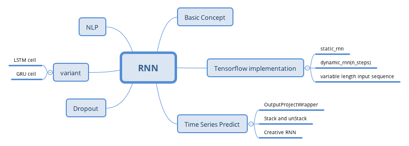

# Exercise

1. Can you think of a few applications for sequence-to-sequence RNN? What about a sequence-to-vector RNN? And a vector-to-sequence RNN?

- sequence-to-sequence RNN: *predict weather*, *machine translation*, *speech to text*

- sequence-to-vector RNN: *classifying music samples by music genre*, *sentiment analysis*, *product recommendation* 

- vector-to-sequence RNN: image captioning, generating a melody based on a set of parameters

2. Why do people use encoder-decoder RNNs rather than plain sequence-to-sequence RNNs for automatic translation?

3. How could you combine a convlutional neural network with an RNN to classify videos?

To classify videos based on the visual content, one possible architecture could be to make (say) one frame to per second.

4. What can  you deal with variable-length input sequences? What about variable-length output sequences?

